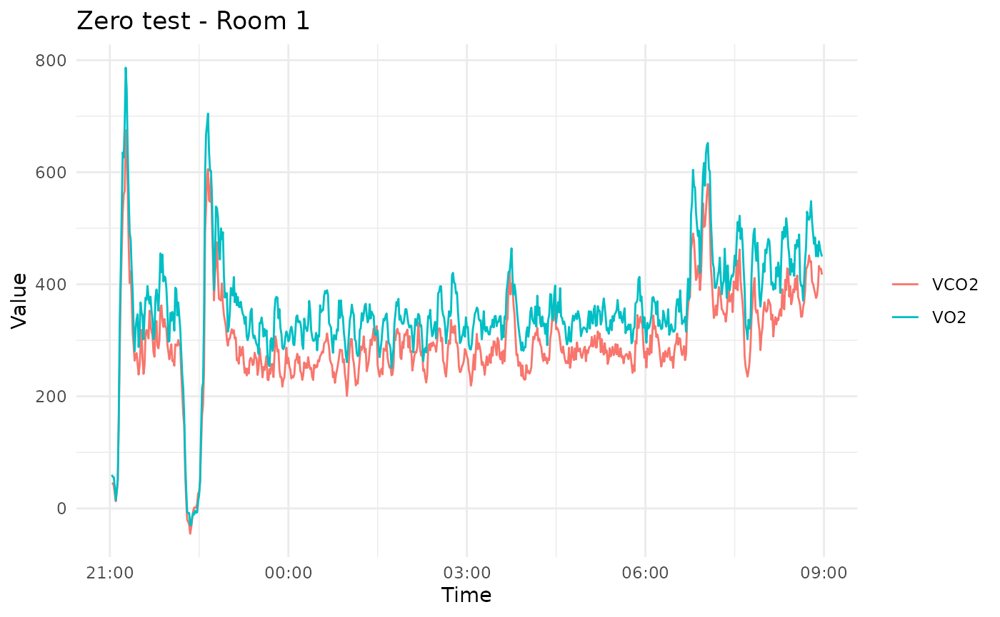
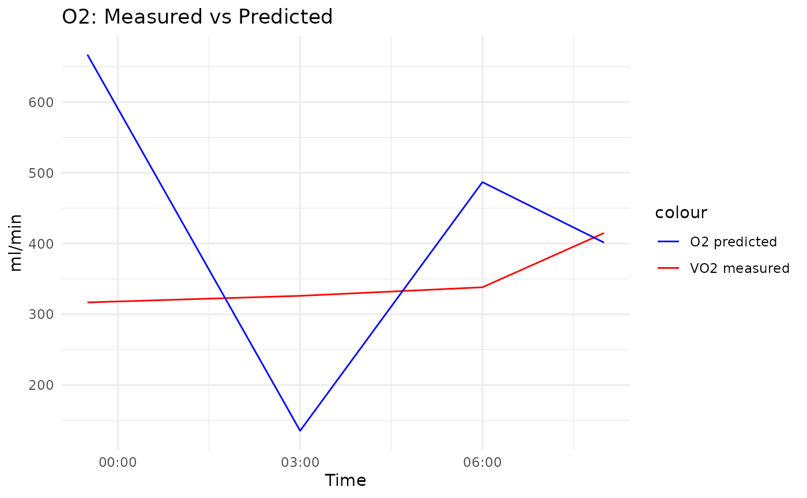
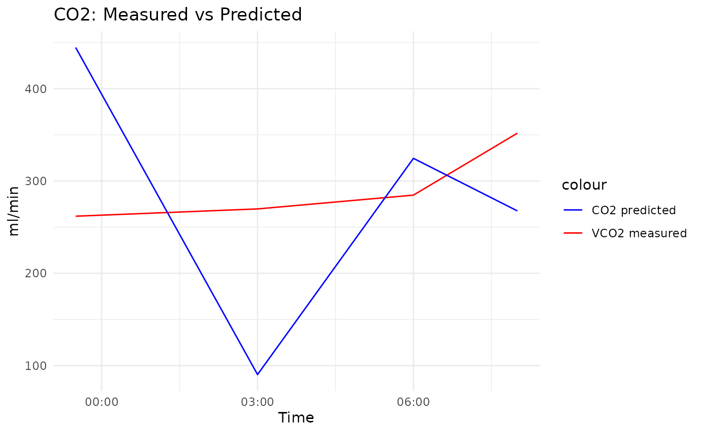
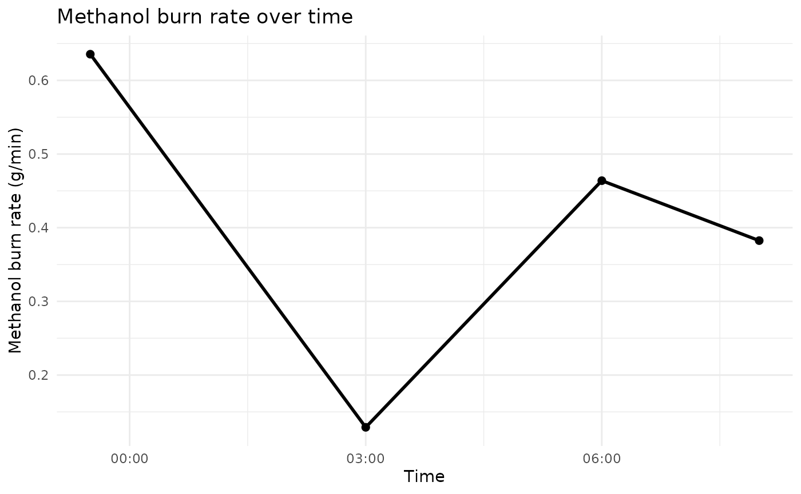

# Analyzing WRIC Data: Zero Tests and Methanol Burns

``` r
library(wrictools)
```

## Introduction

This vignette shows how to analyze **Zero Tests** and **Methanol Burn
experiments** using
[`analyse_zero_test()`](https://ninaziegenbein.github.io/wrictools/reference/analyse_zero_test.md)
and
[`analyse_methanol_burn()`](https://ninaziegenbein.github.io/wrictools/reference/analyse_methanol_burn.md).

------------------------------------------------------------------------

## Zero Test Analysis

A zero test checks the baseline VO2 and VCO2 of the WRIC system, the
mean should be 0 and the standard deviation low and both should be
constant over time. Use
[`analyse_zero_test()`](https://ninaziegenbein.github.io/wrictools/reference/analyse_zero_test.md)
with a data file to get plots and statistics.

``` r
# Example file included with the package
filepath <- system.file("extdata", "data.txt", package = "wrictools")

# Analyse zero test
zero_stats <- analyse_zero_test(filepath)
```



``` r

print(zero_stats)
#> $room1
#>   variable     mean        sd       min      max       slope
#> 1      VO2 356.7205 100.54488 -29.90960 786.6187 0.002766024
#> 2     VCO2 298.4697  87.95359 -45.17043 674.9738 0.002499467
#> 
#> $room2
#>   variable     mean        sd       min      max       slope
#> 1      VO2 332.0050 122.09571 -500.9322 708.2423 0.001944661
#> 2     VCO2 267.9337  99.32789 -413.3808 565.4705 0.001476097
```

As you can see the example data provided with this package does not look
like a zero test, which you can also see when looking at the statistics.
This vignette is intended as a quick example on how to use the package.
If you change the file to your own zero test you can quickly assess
whether the mean is 0, the standard deviation or whether there is an
offset.

## Methanol Burn Analysis

Methanol burns validate energy measurements in the WRIC. Use
[`analyse_methanol_burn()`](https://ninaziegenbein.github.io/wrictools/reference/analyse_methanol_burn.md)
with a WRIC data file and a methanol measurement file. The measurement
file needs two columns named `datetime`and `methanol`. Datetime by
default assume this format “2023-11-13 22:00”, but you can specify your
own dateformat and give it as a parameter to the function.

``` r
# Example WRIC file
data_txt <- system.file("extdata", "data.txt", package = "wrictools")

# Made up methanol measurements to show functionality
methanol_df <- data.frame(
  datetime = as.POSIXct(c(
    "2023-11-13 22:00", "2023-11-13 23:30", "2023-11-14 03:00", "2023-11-14 06:00", "2023-11-14 08:00"
  ), format = "%Y-%m-%d %H:%M"),
  methanol = c(4842.9, 4785.7, 4758.6, 4675.1, 4629.2)
)
methanol_file <- tempfile(fileext = ".csv")
write.csv(methanol_df, methanol_file, row.names = FALSE)

# Analyse methanol burn
methanol_results <- analyse_methanol_burn(filepath = data_txt, methanolfilepath = methanol_file)

print(methanol_results)
#> $per_interval
#> # A tibble: 4 × 14
#>   t1                  t2                  delta_methanol_g delta_CO2_L
#>   <dttm>              <dttm>                         <dbl>       <dbl>
#> 1 2023-11-13 22:00:00 2023-11-13 23:30:00             57.2        40.0
#> 2 2023-11-13 23:30:00 2023-11-14 03:00:00             27.1        19.0
#> 3 2023-11-14 03:00:00 2023-11-14 06:00:00             83.5        58.4
#> 4 2023-11-14 06:00:00 2023-11-14 08:00:00             45.9        32.1
#> # ℹ 10 more variables: delta_O2_L <dbl>, delta_time_min <dbl>,
#> #   CO2_ml_min <dbl>, O2_ml_min <dbl>, methanol_g_min <dbl>,
#> #   VO2_measured <dbl>, VCO2_measured <dbl>, VO2_dev <dbl>, VCO2_dev <dbl>,
#> #   RER <dbl>
#> 
#> $overall
#> # A tibble: 1 × 7
#>   VO2_avg_meas VCO2_avg_meas O2_avg_calc CO2_avg_calc VO2_dev_avg VCO2_dev_avg
#>          <dbl>         <dbl>       <dbl>        <dbl>       <dbl>        <dbl>
#> 1         349.          292.        423.         282.       0.153        0.442
#> # ℹ 1 more variable: RER_avg <dbl>
#> 
#> $plots
#> $plots$O2
```



    #> 
    #> $plots$CO2



    #> 
    #> $plots$RER


    #> 
    #> $plots$burn_rate

 Again these
results are non-sense because the wric-data we’re analyzing is not a
methanol burn and the methanol measurements are fictional as well. But
you can easily see the information the function returns.

We can see the different measurements and most importantly the deviation
between calculated and measured VO2 and VCO2 for each interval, meaning
each time period between two measurements in the methanol measurement
file. This deviation should ideally be 0. If it is not, check whether
this might be at the beginning or end of the file where a door or hatch
might have been opened. There is an additional table showing the same
measurements for the entire period - if you use these values make sure
to cut of any time in the beginning or end that might show noise from
the door opening. You can easily do that by specifying start and end
parameters.

Additionally, 4 plots are created showing predicted vs measured O2 and
CO2 over time. It is important to note that the value from one interval
is plotted at the end point of that interval. The other two plots show
RER over time and the methanol burn rate.
